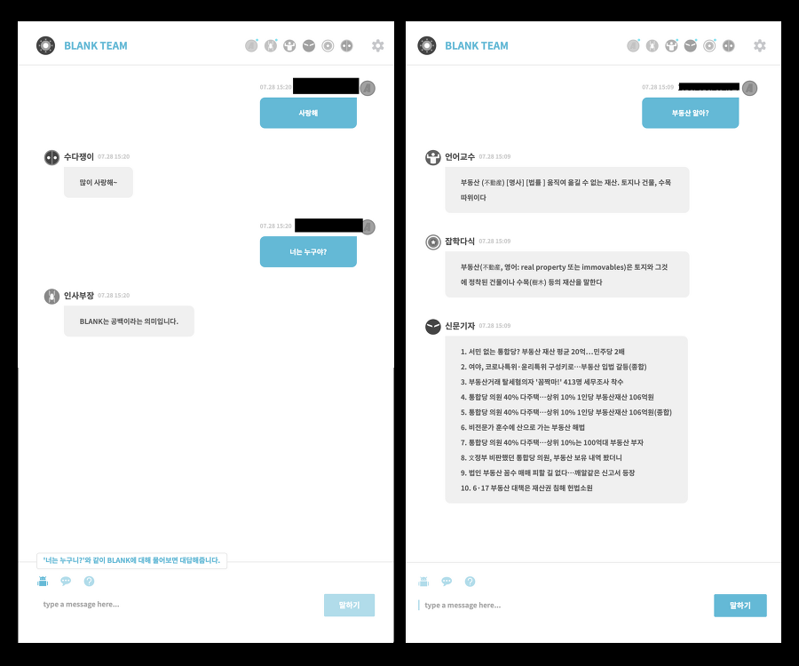

### Blank: 자료 수집 챗봇

[프로젝트 회고록](https://jisulog.com/docs/essay/project-review/2020-blank)

## 개요
챗봇 Blank는 사용자의 질문에 신속하게 대응하는 서비스입니다. 
뉴스, 사전, 위키와 같은 다양한 정보원으로부터 정보를 제공받을 수 있습니다. 
일상 대화 역시 자연스럽게 대답하여 친밀하게 소통합니다. 
Blank는 훌륭한 지식 파트너가 될 것입니다.

## 설치 및 실행 방법
> [demo](https://blank.egoist.im/)  
> 심심이 API를 사용하는 기능은 유로 플랜으로 현재 중단 되었습니다.

## 주요 기능
- 질문을 하면 그에 대한 뉴스, 사전, 위키의 정보를 메시지로 받을 수 있다.
- Blank 자신에 관한 질문했을때 소개 메시지를 받을 수 있다.
- 일상적인 대화에 대답 메시지를 받을 수 있다.

## 기술 스택
- **언어**
    - JSP
    - Java
    - Javascript
    - HTML/CSS
- **서버**
    - Tomcat
- **프레임워크**
    - Spring Framework
- **API, Library**
    - 네이버 뉴스 API
    - 심심이 API
    - Maven
    - JSON-SIMPLE
    - OkHttp
    - Jsoup
- **IDE**
    - Eclipse

## 라이선스
Copyright © 2020. [JISU YANG](https://jisulog.com/). All rights reserved.